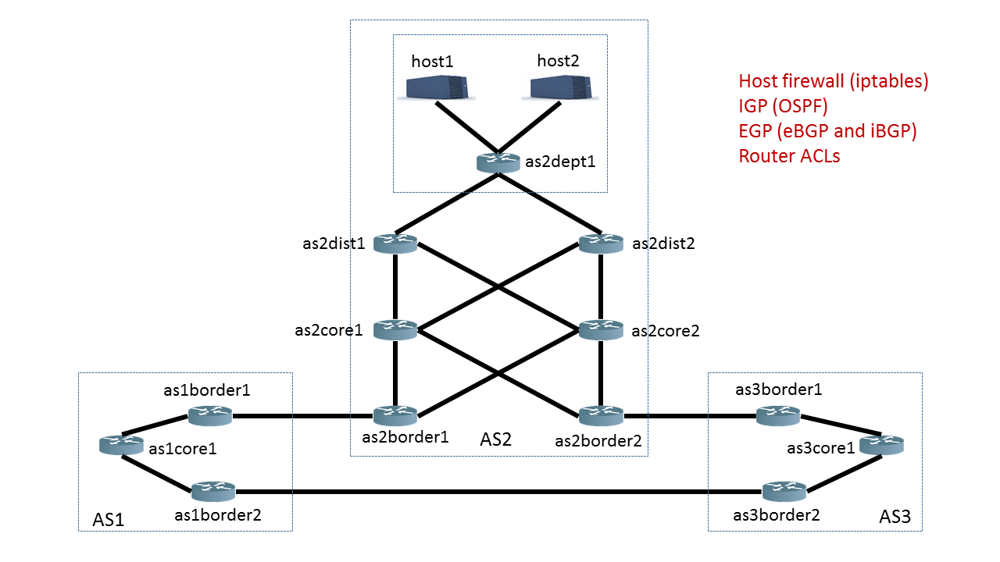
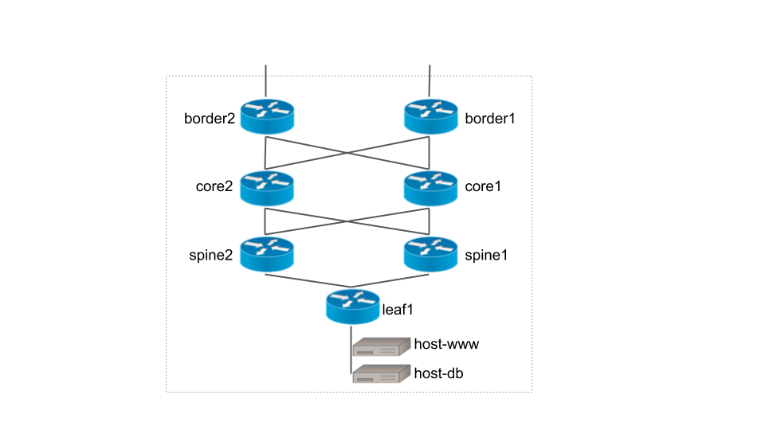

这是我们设计网络图谱图

如何使用自然语言描述网络图谱

首先，描述图中的所有节点：

2个主机：host1 和 host2

13个交换机：as1core1、as1border1、as1border2、as3core1、as3border1、as3border2、as2core1、as2core2、as2border1、as2border2、as2dist1、as2dist2、as2dept1

1. Hosts - host1 和 host2
2. Distribution Switches - as2dist1 和 as2dist2
3. Core Routers - as1core1, as2core1, as2core2, as3core1
4. Border Routers - as1border1, as1border2, as2border1, as2border2, as3border1, as3border2

描述子网规划,其中



1. as1core1 -> as1border1 -> as2border1 -> as2core1 -> as2dist1 -> as2dept1 -> host1
2. as1core1 -> as1border1 -> as2border1 -> as2core1 -> as2dist2 -> as2dept1 -> host1
3. as1core1 -> as1border1 -> as2border1 -> as2core2 -> as2dist1 -> as2dept1 -> host1
4. as1core1 -> as1border1 -> as2border1 -> as2core2 -> as2dist2 -> as2dept1 -> host1


AS1包含设备：as1core1、as1border1、as1border2

AS2包含设备：host1、host2、as2core1、as2core2、as2border1、as2border2、as2dist1、as2dist2、as2dept1

AS3包含设备：as3core1、as3border1、as3border2

设备之间的连接关系如下，每一对设备代表一条边：

[as1core1, as1border1], [as1core1, as1border2], [as1border1, as2border1], [as1border2, as3border2],

[as3border2, as3core1], [as3core1, as3border1], [as3border1, as2border2],

[as2border2,as2core1 ], [as2border2, as2core2], [as2border1, as2core1], [as2border1, as2core2],

[as2core1, as2dist1], [as2core1, as2dist2], [as2core2, as2dist1], [as2core1, as2dist2],

[as2dist1, as2dept1], [as2dist2, as2dept1], [as2dept1, host1], [as2dept1, host2]




```
已知网络中包含以下设备组件
2个主机：host-db,host-www
7个交换机：leaf1,spine1,spine2,core1,core2,border1,border2

网络拓扑图的边由下列设备对组成
[host-www,leaf1],[host-db,leaf1],[leaf1,spine2],[leaf1,spine1],[spine1,core1],[spine1,core2],[spine2,core1],[spine2,core2],[core1,border1],[core1,border2],
[core2,border1],[core2,border2]
```


| 设备名 |      |      |      |      |
| ------ | ---- | ---- | ---- | ---- |
|        |      |      |      |      |
|        |      |      |      |      |
|        |      |      |      |      |
|        |      |      |      |      |
|        |      |      |      |      |
|        |      |      |      |      |
|        |      |      |      |      |
|        |      |      |      |      |
|        |      |      |      |      |

```
```


```
1. 所有交换机都能到达host主机

2. 从border1到host主机的流量必须经过core1
3. 从border2到host主机到流量不可以经过core2
```